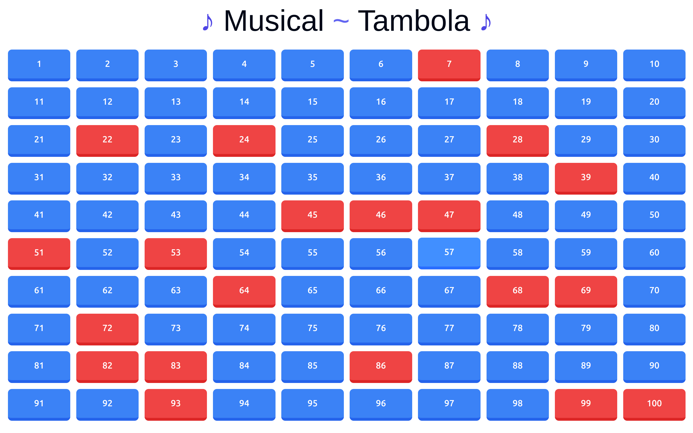

# Musical Tambola 🎵🎲

<br/>



Musical Tambola is an engaging and interactive single-page game that combines the excitement of Tambola (Bingo) with the joy of music. Test your knowledge of Bollywood songs and movies in this fun-filled guessing game!

## 🌟 Features

- 🎬 100 popular Bollywood songs from various movies
- 🔊 High-quality audio clips for each song
- 🎭 Guess the song name and movie title
- 🖼️ Sleek and responsive user interface
- 🌈 Beautiful animations and transitions

## 🏗️ Installation

To get Musical Tambola running on your local machine, follow these steps:

1. Clone the repository:
   ```
   git clone https://github.com/your-username/musical-tambola.git
   ```

2. Navigate to the project directory:
   ```
   cd musical-tambola
   ```

3. Install the dependencies:
   ```
   npm install
   ```

4. Start the development server:
   ```
   npm run dev
   ```

5. Open your browser and visit `http://localhost:5173` to play the game!

## 🎮 How to Play

1. Click on any numbered button on the game board.
2. Listen to the audio clip that plays.
3. Try to guess the song name and movie title.
4. Click the "Answer" button to reveal the correct answer.
5. Mark the song as done by clicking the "Done" button.
6. Continue playing until you complete a line or the full board!

## 🤝 Contributing

If you'd like to contribute, please follow these steps:

1. Fork the repository
2. Create a new branch (`git checkout -b feature/AmazingFeature`)
3. Make your changes
4. Commit your changes (`git commit -m 'Add some AmazingFeature'`)
5. Push to the branch (`git push origin feature/AmazingFeature`)
6. Open a Pull Request

## 📜 License

This project is licensed under the GNU General Public License v3.0 - see the [LICENSE](LICENSE) file for details.

---

Made with ❤️ by [Aditya](https://bento.me/aditya-byte)
